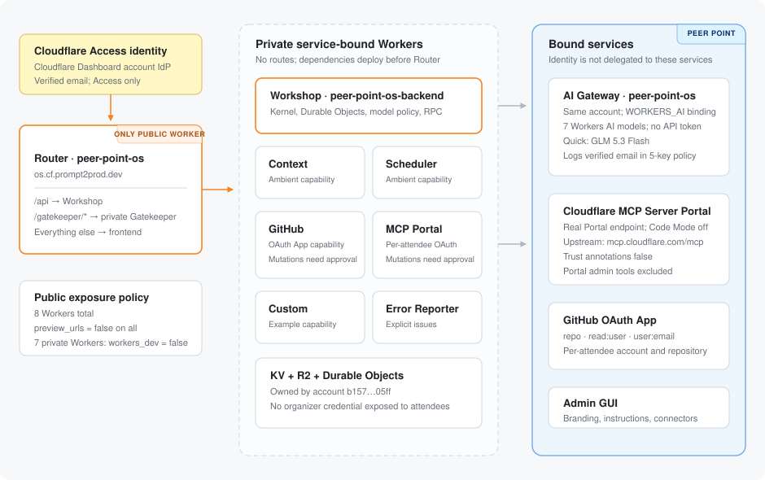

<p align="center">
  
</p>

<h1 align="center">Peer Point OS</h1>

<p align="center">
  A pinned Cloudflare OS distribution for a multi-city beginner hackathon, with Access identity, attendee-owned connections, and a reviewed deployment boundary.
</p>

<p align="center">
  <a href="https://developers.cloudflare.com/workers/"></a>
  <a href="https://nodejs.org/"></a>
  <a href="https://pnpm.io/"></a>
  <a href="https://www.typescriptlang.org/"></a>
  <a href="https://github.com/cloudflare/cloudflare-os"></a>
</p>

> [!IMPORTANT]
> Cloudflare OS is early-access software. Peer Point is not release-ready until the [fresh-account, two-attendee pilot](docs/runbooks.md#fresh-account-two-attendee-pilot) passes. Do not claim browser-only arbitrary-repository deployment before that gate.

## Current distribution

| Control            | Configured value                                                                              |
| ------------------ | --------------------------------------------------------------------------------------------- |
| Cloudflare account | `b157b3849ca30a481cae4bc5d9bc05ff`                                                            |
| Public hostname    | `os.cf.prompt2prod.dev`                                                                       |
| AI Gateway         | `peer-point-os`, in the same account                                                          |
| Identity           | Cloudflare Access only, using the Cloudflare identity provider (Cloudflare Dashboard account) |
| AI provider        | Workers AI only                                                                               |
| Public Workers     | Router only                                                                                   |
| Preview URLs       | Disabled on all eight Workers                                                                 |

The rotated GitHub OAuth secret, Cloudflare API Portal server ID, branding, attendee deployment procedure, and privacy decision are still [required human inputs](docs/runbooks.md#required-human-inputs). Secrets never belong in tracked configuration.

## Architecture



The distribution is eight Workers:

| Worker         | Name                       | Role                                                                |
| -------------- | -------------------------- | ------------------------------------------------------------------- |
| Router         | `peer-point-os`            | Only public route; serves the frontend and proxies private bindings |
| Workshop       | `peer-point-os-backend`    | Kernel, user Durable Objects, model policy, and RPC                 |
| Context        | `peer-point-os-context`    | Ambient Context Gatekeeper                                          |
| Scheduler      | `peer-point-os-scheduler`  | Ambient scheduled-work Gatekeeper                                   |
| GitHub         | `peer-point-os-github`     | Per-attendee GitHub connected capability                            |
| MCP Portal     | `peer-point-os-mcp-portal` | Per-attendee OAuth into a real Cloudflare MCP Server Portal         |
| Custom         | `peer-point-os-custom`     | Example organization capability                                     |
| Error Reporter | `peer-point-os-errors`     | Private explicit-issue destination                                  |

Only Router has a route. `workers.dev` is disabled on the seven private Workers and `preview_urls` is false on all eight. Deployment builds the GitHub and MCP configurators, deploys dependencies before Workshop, and deploys Router last.

## Identity and capabilities

[Cloudflare Access](https://developers.cloudflare.com/cloudflare-one/access-controls/applications/http-apps/self-hosted-public-app/) is the only Peer Point identity boundary. Configure its self-hosted application for `os.cf.prompt2prod.dev` with the [Cloudflare identity provider](https://developers.cloudflare.com/cloudflare-one/integrations/identity-providers/cloudflare/). The backend verifies the Access JWT and requires its non-empty verified email claim. It never accepts browser-supplied email as identity and never forwards or logs the raw JWT.

GitHub and Cloudflare authorization are connected capabilities, not sign-in methods:

- GitHub uses an OAuth App with `repo read:user user:email` and callback `https://os.cf.prompt2prod.dev/gatekeeper/github/oauth`. Repository pushes and other mutations remain approval-gated.
- Cloudflare access uses a real [MCP Server Portal](https://developers.cloudflare.com/cloudflare-one/access-controls/ai-controls/mcp-portals/), with `https://mcp.cloudflare.com/mcp` configured as its upstream. Each attendee completes OAuth for their own Cloudflare account. Portal administration tools cannot be granted and MCP mutations remain approval-gated.

No organizer-wide GitHub, Cloudflare, or deployment token may be shared with attendees. Attendee project changes must stay in attendee-owned repositories and deploy to attendee-owned Cloudflare accounts.

## AI policy

The Workshop reaches the same-account `peer-point-os` AI Gateway over its pre-authenticated `WORKERS_AI` binding. This path requires **no AI Gateway API token**. The provider is exactly `cloudflare`, and the server-enforced catalog is:

1. `@cf/zai-org/glm-5.3`
2. `@cf/zai-org/glm-5.3-flash` — quick model
3. `@cf/zai-org/glm-5.2`
4. `@cf/moonshotai/kimi-k2.6`
5. `@cf/moonshotai/kimi-k2.7-code`
6. `@cf/deepseek-ai/deepseek-v4-flash-0731`
7. `@cf/deepseek-ai/deepseek-v4-pro-0813`

Every AI Gateway request carries the verified Access email as `user_email` through the existing `cf-aig-metadata` path. Metadata is limited to five flat scalar keys: `user_email`, `application`, `source`, `gadget_id`, and `chat_id`. See [Observability](docs/observability.md#ai-gateway-attribution) for privacy implications.

## Prepare and validate

Install the exact workspace toolchain, authenticate Wrangler to the configured account, and initialize both dependency trees:

```sh
git submodule update --init
pnpm install
pnpm --dir cloudflare-os install
pnpm exec wrangler login
```

Before deployment:

1. Resolve every item in [Required human inputs](docs/runbooks.md#required-human-inputs).
2. Create the Access application and DNS policy described in the [Access and DNS runbook](docs/runbooks.md#access-and-dns).
3. Register the GitHub OAuth App and install `CLIENT_SECRET` interactively with Wrangler; do not paste it into a file or command argument.
4. Provision and validate the real MCP Server Portal. The direct Cloudflare API MCP endpoint is an upstream, not the Portal URL.
5. Run:

```sh
pnpm check
pnpm deploy
```

`pnpm check` validates the eight-Worker topology, exactly seven models, private routes, required secret declaration, bindings, configurator builds, and generated Wrangler configuration. Follow the [deployment validation and release gate](docs/runbooks.md#deployment-validation); a successful command alone is not release acceptance.

## Admin customization

Use `/admin` for site name, logo, accent color, announcements, agent instructions, and connector availability. Keep identity, administrators, routes, models, and credentials deployment-controlled. The Admin UI is also the future runtime home for supported skills; implementing custom skills is out of scope for this phase. See [Customization](docs/customization.md).

## Operations

- Follow the focused [runbooks](docs/runbooks.md) for Access/DNS, OAuth and secrets, MCP Portal, privacy, deployment, rollback, upgrades, staging, pilot, and release.
- Use [Workers Logs and traces](docs/observability.md) for runtime telemetry and AI Gateway logs for attendee attribution.
- Roll back compatible Worker versions with [`wrangler rollback`](https://developers.cloudflare.com/workers/versions-and-deployments/rollbacks/) or the documented dashboard deployment history.
- Keep the `cloudflare-os` gitlink and deployment toolchain on exact reviewed versions; never advance a floating branch at release time.
